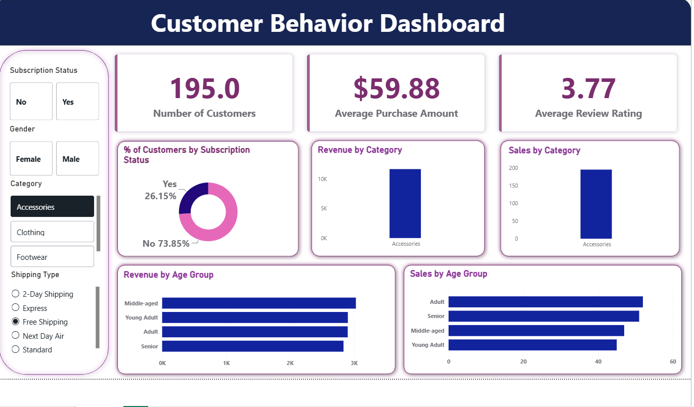

# 📊 Power BI Data Analytics Project

## 📌 Project Overview

This is an end-to-end **Data Analytics and Business Intelligence project** focused on transforming raw data into meaningful and actionable business insights.

The project covers the complete analytics workflow, starting with **data loading, Exploratory Data Analysis (EDA), and data cleaning using Python**, followed by **SQL analysis using PostgreSQL**, and finally the development of an **interactive Power BI dashboard**.

A detailed **project report** and **Gamma presentation** were also created to communicate the analysis, findings, and recommendations.

---

## 🖥️ Power BI Dashboard

### Interactive Dashboard



> The dashboard provides an interactive view of key performance indicators, trends, comparisons, and business insights using Power BI.

---

## 🎯 Project Objectives

The main objectives of this project are to:

* Understand and explore the dataset
* Perform Exploratory Data Analysis (EDA)
* Clean and prepare the data for analysis
* Perform SQL analysis using PostgreSQL
* Identify important trends and patterns
* Create meaningful KPIs and visualizations
* Build an interactive Power BI dashboard
* Generate data-driven business insights
* Prepare a detailed analytical report
* Present the project findings using Gamma

---

# 📂 Dataset

The project uses a structured dataset containing business-related information for analysis.

### Dataset Preparation

The dataset went through the following stages:

1. Loaded the raw dataset into Python
2. Explored the dataset using EDA
3. Checked data types and data quality
4. Identified missing values and duplicate records
5. Cleaned and transformed the data
6. Loaded the cleaned data into PostgreSQL
7. Performed SQL-based analysis
8. Used the analyzed data for Power BI visualization

**Dataset:** `Add your dataset name here`

**Dataset Source:** `Add dataset source here`

---

# 🛠️ Tools & Technologies

| Tool / Technology           | Purpose                                 |
| --------------------------- | --------------------------------------- |
| 🐍 **Python**               | Data loading, EDA, and data cleaning    |
| 🐼 **Pandas**               | Data manipulation and preprocessing     |
| 📈 **Matplotlib / Seaborn** | Exploratory data visualization          |
| 🐘 **PostgreSQL**           | SQL analysis and querying               |
| 📊 **Power BI**             | Dashboard development and visualization |
| 🎨 **Gamma**                | Project presentation                    |
| 📄 **PDF / Document**       | Project report                          |
| 🐙 **GitHub**               | Project documentation and portfolio     |

---

# 🔄 Project Workflow

```text
                  Raw Dataset
                       │
                       ▼
              Data Loading in Python
                       │
                       ▼
          Exploratory Data Analysis (EDA)
                       │
                       ▼
             Data Cleaning & Preparation
                       │
                       ▼
              PostgreSQL SQL Analysis
                       │
                       ▼
              Power BI Data Analysis
                       │
                       ▼
           Interactive Power BI Dashboard
                       │
                       ▼
                Business Insights
                       │
              ┌────────┴────────┐
              ▼                 ▼
        Project Report    Gamma Presentation
```

---

# 🐍 1. Data Loading & Exploratory Data Analysis

Python was used to load, inspect, and understand the dataset before performing further analysis.

### EDA Activities

* Loaded the dataset using Pandas
* Examined the number of rows and columns
* Checked data types
* Identified missing values
* Checked duplicate records
* Analyzed numerical and categorical variables
* Examined data distributions
* Identified potential outliers
* Studied relationships between important variables
* Created visualizations to identify trends and patterns

### Example

```python
import pandas as pd

df = pd.read_csv("dataset.csv")

print(df.head())
print(df.shape)
print(df.info())
print(df.isnull().sum())
```

---

# 🧹 2. Data Cleaning & Preparation

The raw dataset was cleaned and prepared before performing SQL analysis and building the Power BI dashboard.

### Data Cleaning Activities

* Handled missing values
* Removed duplicate records
* Corrected data types
* Standardized inconsistent values
* Checked for invalid or inconsistent entries
* Treated outliers where required
* Created required calculated or derived fields
* Prepared the final dataset for PostgreSQL and Power BI

The cleaned dataset was then used for SQL analysis and dashboard development.

---

# 🗄️ 3. PostgreSQL Analysis

**PostgreSQL** was used to perform SQL-based analysis on the cleaned dataset.

The analysis focused on answering relevant business questions and identifying useful patterns.

### SQL Concepts Used

* `SELECT`
* `WHERE`
* `GROUP BY`
* `ORDER BY`
* Aggregate functions
* `JOIN`
* Subqueries
* Common Table Expressions (CTEs)
* Window functions
* Conditional logic
* Data filtering and segmentation

### Example Query

```sql
SELECT
    category,
    COUNT(*) AS total_records,
    SUM(sales) AS total_sales
FROM dataset
GROUP BY category
ORDER BY total_sales DESC;
```

The PostgreSQL queries used in this project are available in the project repository.

---

# 📊 4. Power BI Dashboard

Power BI is the **main Business Intelligence and visualization component** of this project.

The cleaned and analyzed data was transformed into an interactive dashboard to make important business information easier to understand.

### Dashboard Features

* 📌 KPI Cards
* 📊 Bar Charts
* 📈 Line Charts
* 🍩 Pie / Donut Charts
* 📋 Tables and Matrix visuals
* 🔎 Interactive slicers
* 🎯 Filters
* 📅 Trend analysis
* 📂 Category-wise analysis
* 📊 Performance comparisons
* 📈 Interactive data exploration

### Key KPIs

> Replace these with the actual KPIs from your dashboard.

* **Total Sales:** `Add value`
* **Total Profit:** `Add value`
* **Total Orders:** `Add value`
* **Total Customers:** `Add value`
* **Average Sales:** `Add value`
* **Growth Rate:** `Add value`

---

# 🔍 5. Key Insights

The analysis performed using Python, PostgreSQL, and Power BI helped identify important patterns and business insights.

### Major Findings

* Identified the highest-performing categories
* Identified lower-performing areas
* Analyzed trends over time
* Compared performance across different segments
* Identified important business KPIs
* Examined relationships between key variables
* Identified patterns that can support data-driven decision-making

### Business Recommendations

Based on the analysis:

* Focus on high-performing categories and segments
* Investigate factors affecting low-performing areas
* Monitor important KPIs regularly
* Use dashboard insights to support data-driven decisions

> **Replace these points with your actual findings from the project.**

---

# 🖥️ Dashboard Preview

The final Power BI dashboard provides an interactive visual summary of the analysis.


### Dashboard Highlights

* Interactive KPI monitoring
* Data filtering using slicers
* Trend and performance analysis
* Category-wise comparisons
* Business-focused visualizations
* Easy-to-understand data storytelling

---

# 📑 6. Project Report

A detailed report was created to document the complete analytics process and findings.

### Report Contents

* Project Introduction
* Problem Statement
* Project Objectives
* Dataset Description
* Data Cleaning Methodology
* Exploratory Data Analysis
* PostgreSQL Analysis
* Power BI Dashboard
* Key Findings
* Business Insights
* Recommendations
* Conclusion

📄 **Project Report:** `Add your report link here`

---

# 🎤 7. Gamma Presentation

A professional presentation was created using **Gamma** to communicate the project findings in a clear and visual format.

### Presentation Contents

* Project Overview
* Business Problem
* Dataset
* Data Preparation
* Exploratory Data Analysis
* PostgreSQL Analysis
* Power BI Dashboard
* Key Insights
* Recommendations
* Conclusion

🎤 **Gamma Presentation:** `Add your Gamma presentation link here`

---

# 📁 Project Files

The repository contains the following project resources:

```text
Power-BI-Data-Analytics-Project/
│
├── README.md
├── dashboard.png
├── Dataset
├── Python_Analysis
├── PostgreSQL_Queries.sql
├── PowerBI_Dashboard.pbix
├── Project_Report.pdf
└── Gamma_Presentation.pdf
```

---

# ▶️ How to Explore the Project

### 1. Dataset

The dataset used for the project is provided in the repository.

### 2. Python Analysis

The Python analysis contains the steps performed for:

* Data loading
* Exploratory Data Analysis
* Data cleaning
* Data preparation

### 3. PostgreSQL Analysis

The cleaned dataset was analyzed using PostgreSQL.

The SQL queries used for the analysis are included in the repository.

### 4. Power BI Dashboard

Open the `.pbix` file using **Power BI Desktop**.

The dashboard can be explored using the available:

* Slicers
* Filters
* KPIs
* Charts
* Tables
* Interactive visualizations

### 5. Project Report

The detailed report provides a complete explanation of the methodology, analysis, findings, and recommendations.

### 6. Gamma Presentation

The Gamma presentation provides a concise visual summary of the complete project.

---

# 💼 Skills Demonstrated

### Data Analytics

* Data Cleaning
* Data Preprocessing
* Exploratory Data Analysis
* Data Visualization
* Business Analysis
* Data Interpretation

### Python

* Python
* Pandas
* NumPy
* Matplotlib
* Seaborn

### SQL

* SQL
* PostgreSQL
* Data Aggregation
* Joins
* CTEs
* Subqueries
* Window Functions

### Business Intelligence

* Power BI
* Dashboard Development
* KPI Creation
* Data Modeling
* Interactive Visualizations
* Data Storytelling

### Communication

* Business Reporting
* Presentation Development
* Insight Communication

---

# 🌟 Project Highlights

* ✅ End-to-end data analytics workflow
* ✅ Python-based EDA and data cleaning
* ✅ PostgreSQL SQL analysis
* ✅ Interactive Power BI dashboard
* ✅ KPI-driven business analysis
* ✅ Data-driven insights and recommendations
* ✅ Detailed project report
* ✅ Professional Gamma presentation

---

# 📌 Conclusion

This project demonstrates an end-to-end **Data Analytics and Business Intelligence workflow**, starting from raw data and progressing through data exploration, cleaning, PostgreSQL analysis, visualization, and business reporting.

The Power BI dashboard transforms the analyzed data into an interactive and easy-to-understand visual experience, helping users identify important trends, compare performance, and derive meaningful business insights.

The project demonstrates practical skills relevant to **Data Analyst, Business Analyst, and Business Intelligence roles**.

---

# 👩‍💻 Author

## Bhoomi Srivastava

**B.Tech CSE | Artificial Intelligence**

📌 **LinkedIn:** 
linkedin.com/in/bhoomi-srivastava-68a0b929a

---

⭐ **If you found this project interesting, feel free to star the repository!**
